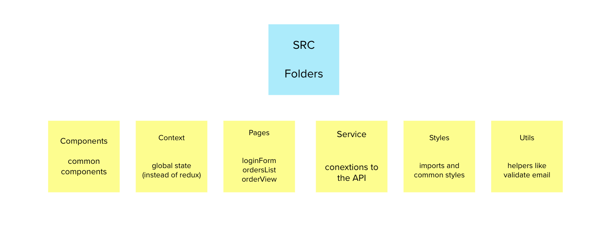

# Order Status

[LIVE DEMO](https://orders-status-app.vercel.app/)

This project was bootstrapped with [Create React App](https://github.com/facebook/create-react-app).
It renders an interface to see orders related to an email.

## Project structure

## Available Scripts

In the project directory, you can run:

### `npm run start`

Runs the app in the development mode.\
Open [http://localhost:3000](http://localhost:3000) to view it in the browser.

### `npm run test`

Launches jest tests

### `npm run test-u`

To update snapshots

# API REPO
[View api repo](https://github.com/kimbali/orders-status-app)
